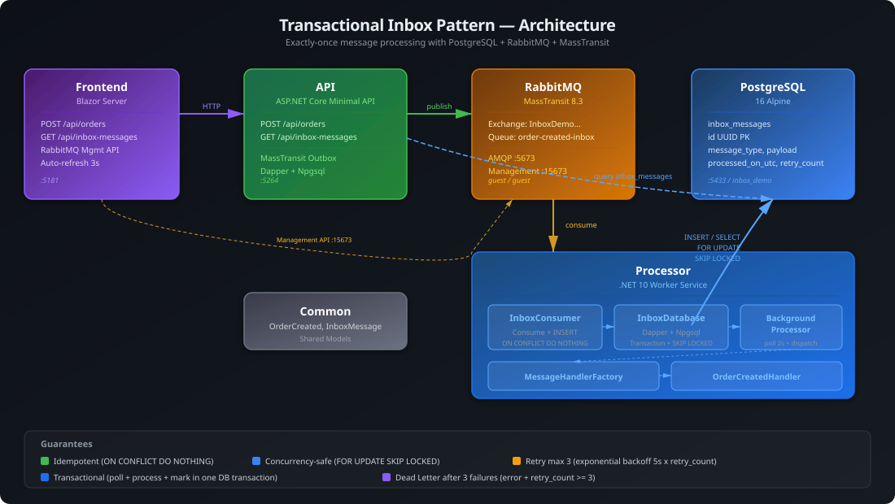

# Transactional Inbox Pattern Demo / 事务性收件箱模式演示



A .NET 10 demo of the **Transactional Inbox Pattern** — ensuring exactly-once message processing by decoupling message reception from business logic execution.

事务性收件箱模式演示：通过将消息接收与业务逻辑执行解耦，确保消息的精确一次处理。

## Tech Stack / 技术栈

| Layer | Technology |
|-------|-------------|
| API | ASP.NET Core Minimal API, MassTransit 8.3, RabbitMQ |
| Processor | .NET Worker Service, MassTransit Consumer, Dapper |
| Frontend | Blazor Server (InteractiveServer), Bootstrap 5 |
| Database | PostgreSQL 16 |
| Message Broker | RabbitMQ 3 |
| Infrastructure | Docker Compose |

## Modules / 模块

| Project | Type | Responsibility |
|---------|------|---------------|
| **InboxDemo.Api** | Minimal API | `POST /api/orders` publishes `OrderCreated` events; `GET /api/inbox-messages` queries inbox status |
| **InboxDemo.Processor** | Worker Service | `InboxConsumer` persists to `inbox_messages`; `InboxBackgroundProcessor` polls and dispatches to handlers |
| **InboxDemo.Common** | Class Library | Shared models: `OrderCreated`, `InboxMessage` |
| **InboxDemo.Frontend** | Blazor Server | Order creation form, inbox messages monitor, RabbitMQ queue viewer |

## Data Flow / 数据流

```
Frontend ─POST /api/orders─> Api ─publish─> RabbitMQ ─consume─> InboxConsumer
                                                                        │
                                        InboxBackgroundProcessor <──  INSERT
                                              │                  inbox_messages
                                              │                       │
                                              └─ poll (2s) ──────────┘
                                                  │
                                                  ▼
                                          IMessageHandler
                                        (OrderCreatedHandler)
```

**Key guarantees:**
- **Idempotent**: `ON CONFLICT (id) DO NOTHING` — duplicate messages silently ignored
- **Concurrency-safe**: `FOR UPDATE SKIP LOCKED` — multiple processor instances safe
- **Retry**: max 3 attempts; failed messages tracked with error text
- **Routing**: `MessageHandlerFactory` maps message types to handlers

## PostgreSQL ↔ InboxDemo.Processor 交互流程

### 表结构 `inbox_messages`

| 列 | 类型 | 说明 |
|---|---|---|
| `id` | UUID PK | MassTransit MessageId |
| `message_type` | VARCHAR(500) | 完整类型名，如 `InboxDemo.Common.Models.OrderCreated` |
| `payload` | JSONB | 消息体 JSON |
| `received_on_utc` | TIMESTAMPTZ | 入库时间 |
| `processed_on_utc` | TIMESTAMPTZ | 处理完成时间（NULL = 未处理） |
| `error` | TEXT | 失败原因 |
| `retry_count` | INT | 已重试次数 |

**部分索引（加速查询）:**
- `idx_inbox_messages_unprocessed` — `WHERE processed_on_utc IS NULL AND error IS NULL`
- `idx_inbox_messages_error` — `WHERE error IS NOT NULL AND retry_count < 3`

### 四条 SQL 操作

#### 1. 初始化 `InitializeAsync`（启动时执行一次）

Processor 启动时自动创建 `inbox_messages` 表和索引（`IF NOT EXISTS`），无需手动建表。

#### 2. 幂等插入 `InsertMessageAsync`（InboxConsumer 调用）

```sql
INSERT INTO inbox_messages (id, message_type, payload, received_on_utc, retry_count)
VALUES (@Id, @MessageType, @Payload::jsonb, @ReceivedOnUtc, @RetryCount)
ON CONFLICT (id) DO NOTHING   -- 重复 MessageId 静默忽略
RETURNING id;
```

- 返回 `id` → 新消息
- 返回 `NULL` → 重复消息被忽略

#### 3. 轮询拉取 `GetUnprocessedMessagesAsync`（每 2 秒）

```sql
SELECT id, message_type, payload::text, received_on_utc, processed_on_utc, error, retry_count
FROM inbox_messages
WHERE processed_on_utc IS NULL            -- 未处理
  AND (error IS NULL OR retry_count < 3)  -- 或可重试
ORDER BY received_on_utc
LIMIT 10                                  -- 每批最多 10 条
FOR UPDATE SKIP LOCKED;                   -- 行级锁 + 跳过已锁行
```

`FOR UPDATE SKIP LOCKED` 的含义:
- `FOR UPDATE` — 对选中行加排他锁，防止并发处理同一行
- `SKIP LOCKED` — 已被其他事务锁定的行直接跳过，不等待
- **效果**: 多个 Processor 实例可安全并行处理不同消息

#### 4. 更新状态（处理完成后）

**成功:**
```sql
UPDATE inbox_messages
SET processed_on_utc = NOW(), error = NULL
WHERE id = @Id;
```

**失败:**
```sql
UPDATE inbox_messages
SET error = @Error, retry_count = retry_count + 1, processed_on_utc = NULL
WHERE id = @Id;
-- retry_count 达到 3 后，不再被 WHERE 条件命中 → Dead Letter
```

### 消息状态流转

```
         INSERT (InboxConsumer)
           │
           ▼
     ┌─────────────┐
     │   Pending    │   processed_on_utc=NULL, error=NULL
     │   (待处理)   │
     └──────┬──────┘
            │ BackgroundProcessor poll (every 2s)
            ▼
     ┌─────────────┐    成功     ┌─────────────┐
     │  Processing  │───────────▶│  Processed   │
     │  (处理中)    │            │  (已处理)    │  processed_on_utc=NOW()
     └──────┬──────┘            └─────────────┘
            │ 失败
            ▼
     ┌─────────────┐  retry<3   ┌─────────────┐
     │   Failed     │───────────▶│   Retrying   │──▶ 回到 Pending 队列
     │   (失败)     │            │   (重试中)   │
     └──────┬──────┘            └─────────────┘
            │ retry >= 3
            ▼
     ┌─────────────┐
     │  Dead Letter │   error != NULL, retry_count >= 3
     │  (死信)      │   不再被查询命中
     └─────────────┘
```

## Quick Start / 快速启动

```bash
# 1. Start infrastructure
docker compose up -d

# 2. Build solution
dotnet build "Inbox Pattern Demo.slnx"

# 3. Run services (in separate terminals)
dotnet run --project InboxDemo.Api          # http://localhost:5264
dotnet run --project InboxDemo.Processor    # (background worker)
dotnet run --project InboxDemo.Frontend    # http://localhost:5181
```

RabbitMQ Management: http://localhost:15673 (guest/guest)

## API Endpoints

### POST /api/orders

Create an order and publish `OrderCreated` event.

**Request:**
```json
{
  "customerName": "Alice",
  "amount": 99.99
}
```

**Response:**
```json
{
  "orderId": "f12e2ac7-cf3a-474b-9cd4-5d83b4529997",
  "message": "Order created event published"
}
```

### GET /api/inbox-messages

Query inbox message status (last 100, ordered by received time desc).

**Response:**
```json
[
  {
    "id": "b0490000-091b-8447-...",
    "messageType": "InboxDemo.Common.Models.OrderCreated",
    "payload": "{\"Amount\": 99.99, ...}",
    "receivedOnUtc": "2026-06-10T00:33:32.144Z",
    "processedOnUtc": "2026-06-10T00:33:33.683Z",
    "error": null,
    "retryCount": 0
  }
]
```

## Frontend Pages

| Route | Description |
|-------|-------------|
| `/` | Architecture overview and pattern explanation |
| `/create-order` | Form to create orders and publish events |
| `/inbox-messages` | Real-time inbox message status (auto-refresh 3s) |
| `/rabbitmq` | RabbitMQ queue viewer with message inspection |
