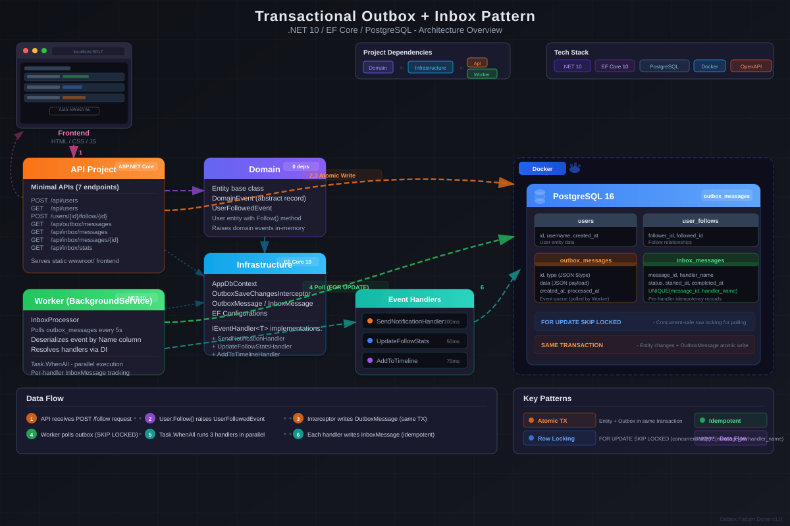

# Outbox & Inbox Pattern Demo

Transactional Outbox + Inbox Pattern 演示项目 / A demo of the Transactional Outbox + Inbox Pattern built on .NET 10.



## Tech Stack

| Category | Technology |
|----------|-----------|
| Runtime | .NET 10 / ASP.NET Core 10 |
| ORM | Entity Framework Core 10 |
| Database | PostgreSQL 16 (Docker) |
| Serialization | System.Text.Json |
| API Style | Minimal APIs |
| Frontend | Vanilla HTML/CSS/JS |
| OpenAPI | Scalar.AspNetCore |

## Modules

| Module | Project | Responsibility |
|--------|---------|---------------|
| Domain | `OutboxPatternDemo.Domain` | Entities, domain events, business rules |
| Infrastructure | `OutboxPatternDemo.Infrastructure` | DbContext, outbox interceptor, inbox/outbox entities, EF config, IEventHandler interface |
| API | `OutboxPatternDemo.Api` | REST endpoints, static frontend, DB bootstrap |
| Worker | `OutboxPatternDemo.Worker` | InboxProcessor background service, event handlers |

## Architecture

```
Domain (entities, domain events)
  ^
  |
Infrastructure (DbContext, interceptor, entities, EF config, IEventHandler interface)
  ^           ^
  |           |
Api          Worker (event handlers, InboxProcessor)
```

### Data Flow

1. **API** receives request (e.g., `POST /api/users/{followerId}/follow/{followedId}`)
2. **Entity** raises domain event (`User.Follow()` adds `UserFollowedEvent`)
3. **OutboxSaveChangesInterceptor** captures events, serializes to JSON, inserts `OutboxMessage` rows **in the same database transaction** as the entity changes (atomic write)
4. **InboxProcessor** (Worker `BackgroundService`) polls `outbox_messages` every 5s using PostgreSQL `FOR UPDATE SKIP LOCKED` for safe concurrent processing
5. Each message is processed in its **own savepoint** within the outer lock transaction: handlers execute serially; on failure the savepoint rolls back, orphaned `InboxMessage` entities are cleaned from the ChangeTracker, and `RetryCount` is persisted outside the savepoint scope
6. Each handler creates its own `InboxMessage` record with a unique index on `(MessageId, HandlerName)` for per-handler idempotency

### Event Handlers

| Handler | Simulation |
|---------|-----------|
| `SendNotificationOnUserFollowedHandler` | 100ms delay |
| `UpdateFollowStatsHandler` | 50ms delay |
| `AddToTimelineHandler` | 75ms delay |

## Quick Start

```bash
# Start PostgreSQL
docker-compose up -d

# Build
dotnet build "Outbox Pattern Demo.slnx"

# Run API (http://localhost:5017)
dotnet run --project OutboxPatternDemo.Api

# Run Worker (in another terminal)
dotnet run --project OutboxPatternDemo.Worker
```

The database schema is auto-created on API startup via `EnsureCreatedAsync()`.

## API Endpoints

| Method | Route | Description |
|--------|-------|-------------|
| POST | `/api/users` | Create a user |
| GET | `/api/users` | List all users |
| POST | `/api/users/{followerId}/follow/{followedId}` | Follow a user (triggers outbox event) |
| GET | `/api/outbox/messages` | Latest 20 outbox messages |
| GET | `/api/inbox/messages` | Latest 20 inbox messages (with handler info) |
| GET | `/api/inbox/messages/{messageId}` | Handler executions for a specific message (includes processing time) |
| GET | `/api/inbox/stats` | Aggregated stats per event type + handler |

## Example

```bash
# Create users
curl -X POST http://localhost:5017/api/users \
  -H 'Content-Type: application/json' \
  -d '{"username":"alice"}'

curl -X POST http://localhost:5017/api/users \
  -H 'Content-Type: application/json' \
  -d '{"username":"bob"}'

# Alice follows Bob (triggers outbox -> inbox pipeline)
curl -X POST http://localhost:5017/api/users/{alice-id}/follow/{bob-id}

# Check outbox messages
curl http://localhost:5017/api/outbox/messages

# Check inbox messages (after ~5s Worker polling)
curl http://localhost:5017/api/inbox/messages

# Check processing stats
curl http://localhost:5017/api/inbox/stats
```

## Frontend

Open `http://localhost:5017` in a browser. The UI provides:

- User creation and follow operations
- Real-time outbox/inbox message listing (auto-refresh every 5s)
- Clickable outbox messages to view per-handler execution details
- Processing stats table with handler-level metrics

## Key Design Decisions

- **No external message broker** -- PostgreSQL tables serve as both outbox and inbox queues
- **Atomic outbox writes** via EF Core `SaveChangesInterceptor` (same transaction as business data)
- **Concurrent-safe polling** using PostgreSQL `FOR UPDATE SKIP LOCKED`
- **Savepoint-based per-message transactions** -- outer transaction holds row locks; per-message savepoints isolate handler failures so `RetryCount` survives rollback without leaking orphaned `InboxMessage` records
- **Per-handler idempotency** via unique index on `(MessageId, HandlerName)`
- **Strongly typed handlers** via `IEventHandler` / `IEventHandler<TEvent>` interfaces (no `dynamic` dispatch)
- **Retry with max 3 attempts** for failed messages
- **Configurable polling interval** via `PollingIntervalSeconds` in Worker `appsettings.json`
- **EF Core `IEntityTypeConfiguration<T>`** for all entity mappings (`UserConfiguration`, `OutboxMessageConfiguration`, `InboxMessageConfiguration`)
